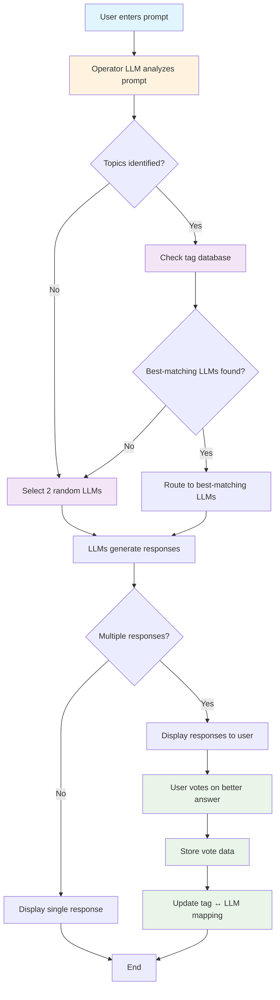

# LLM Routing System - Next League

## Overview
A Next League branded LLM interface that analyzes user prompts and routes them to the most relevant LLM(s) based on topic analysis and learning from user feedback.

## Problem Statement
It's difficult to know which LLM is best suited for a given task. Different LLMs excel at different domains (finance, tech stack, design, strategy, marketing, etc.), but users often don't know which one to choose.

## Solution Architecture

### Core Components
1. **User Interface**: Single text box for prompt input
2. **Operator LLM**: Analyzes prompts and routes to appropriate LLMs
3. **Tag-Based Routing System**: Maps topics to LLM strengths
4. **Feedback System**: Collects user votes to improve routing
5. **Learning Database**: Stores tag ↔ LLM mapping data

## Flow Diagram

## Detailed Process Flow

### 1. Prompt Analysis
- User submits prompt through single text box
- Operator LLM analyzes the prompt content
- Identifies relevant topics and domains

### 2. Routing Decision
- **If topics are identified**: Check existing tag database for best-matching LLMs
- **If no topics found**: Select 2 random LLMs for comparison

### 3. Response Generation
- Selected LLM(s) generate responses to the user's prompt
- Responses are presented to the user

### 4. Feedback Collection
- If multiple responses are shown, user votes on the better answer
- Vote data is stored for learning purposes

### 5. Learning & Improvement
- Vote data is used to refine the tag ↔ LLM mapping
- Database is updated with new insights about LLM performance

## Tag Categories

The system recognizes and routes based on these topic categories:

- **Finance**: Financial analysis, investment advice, accounting
- **Tech Stack**: Programming, software development, technical architecture
- **Design**: UI/UX, graphic design, creative direction
- **Strategy**: Business strategy, planning, decision-making
- **Marketing**: Digital marketing, branding, customer acquisition
- **Research**: Data analysis, market research, academic topics
- **Writing**: Content creation, copywriting, documentation
- **General**: Broad topics, general knowledge, miscellaneous
